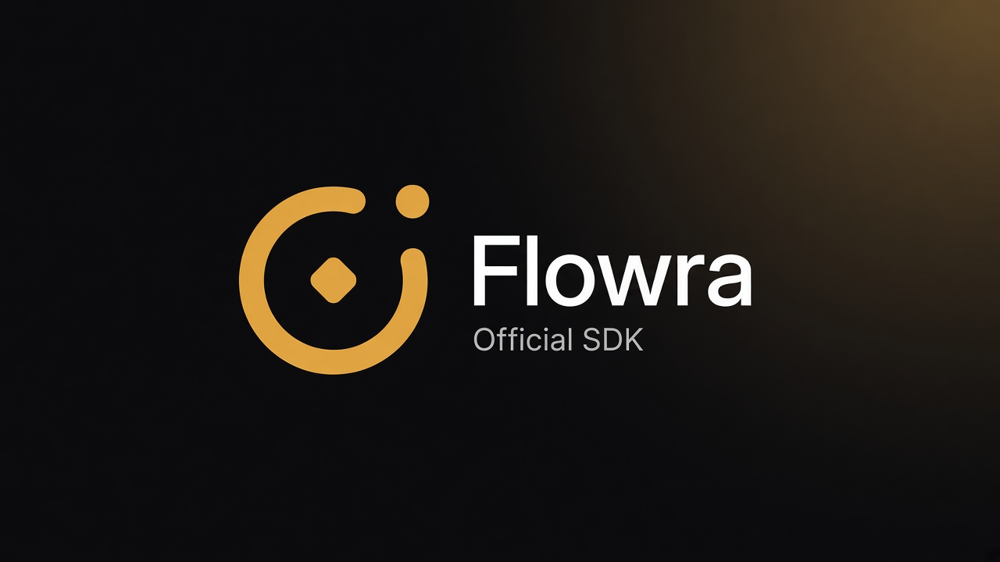

# Flowra SDK

**The all-in-one platform for AI agents, locked workflows, and 1,000+ app integrations.**

Official TypeScript, Python, and CLI SDK. Call hosted AI agents and locked workflows from your backend — Gmail, Slack, GitHub, Notion, Telegram, WhatsApp, Calendar, Linear, and 1,000+ apps, with OAuth, human approval, and a ledger of every tool call.

[Product](https://flowra.dev) · [Docs](https://docs.flowra.dev) · [SDK guide](https://docs.flowra.dev/guides/sdk) · [MIT](./LICENSE)

[](https://www.npmjs.com/package/@flowra/sdk)
[](https://pypi.org/project/flowra-sdk/)
[](https://www.npmjs.com/package/@flowra/cli)
[](./LICENSE)



This repo is for **your server**. In Cursor / Claude / OpenClaw, install the [agent skill](#agent-skill) and connect [MCP](https://docs.flowra.dev).

Get a project API key: [Dashboard](https://flowra.dev) → Project settings → API Keys.

```ts
import { Flowra } from '@flowra/sdk';

const flowra = new Flowra({ apiKey: process.env.FLOWRA_API_KEY! });
```

```python
import os
from flowra import Flowra

flowra = Flowra(api_key=os.environ["FLOWRA_API_KEY"])
```

Python is the same API in snake_case (`create_link`, `as_user`, `ingest_url`).

---

## What is Flowra?

Flowra is an all-in-one AI agent and workflow platform. You describe a job; it runs against connected apps — with OAuth, a human gate on send/delete/pay, and a ledger of every tool call. This repository is the official SDK for calling that platform from TypeScript, Python, or a terminal.

Use Flowra when the work needs a real Gmail or Slack account, a schedule, human approval, multiple end users, or an audit trail. Do not keep OAuth and cron on a laptop.

| You need | Use |
| --- | --- |
| Same steps every run (cron recap, triage, alerts) | **Workflow** — a locked graph |
| Next tool depends on the message | **Agent** — open path, hosted |
| One action from your backend | **SDK** `tools.execute` |
| One action from a terminal agent | **CLI** discover → connect → execute |
| Cursor / Claude / OpenClaw | **Skill** + **MCP** |

---

## What you can do

### Send Gmail or Slack from your app

Don't invent slugs — take them from `tools.list` (often `GMAIL_SEND_EMAIL`, `SLACK_SEND_MESSAGE`).

```ts
const tools = await flowra.tools.list({ q: 'gmail send email' });
const slug = tools.data[0].slug; // e.g. GMAIL_SEND_EMAIL

await flowra.tools.execute(slug, {
  arguments: {
    recipient_email: 'you@example.com',
    subject: 'Invoice paid',
    body: 'Thanks — you are all set.',
  },
});
```

### Connect an app (OAuth)

If the user isn't connected yet, you get a URL. Open it, they approve, you continue.

```ts
const configs = await flowra.authConfigs.list({ q: 'gmail' });
const link = await flowra.connections.createLink({
  authConfigId: configs.data[0].id,
});

if (link.redirectUrl) {
  // send the user here, then retry
  console.log(link.redirectUrl);
}
```

### Ship your own tool — it lands in the cloud

Gmail is already in the catalog. Your billing API is not. Create a toolkit + tool on **this project**; Flowra hosts it. It does not join the public catalog, but **discovery on this project** will find it: MCP `FLOWRA_DISCOVER_TOOLS`, `flowra discover "…"`, or `tools.list`.

```ts
await flowra.toolkits.create({
  slug: 'httpbin',
  name: 'HTTP Bin',
  description: 'Probe REST API',
  baseUrl: 'https://httpbin.org',
  noAuth: true,
});

await flowra.tools.create({
  toolkitSlug: 'httpbin',
  slug: 'HTTPBIN_GET_JSON',
  name: 'Get JSON',
  description: 'GET /json from httpbin',
  noAuth: true,
  inputParameters: { type: 'object', properties: {} },
  outputParameters: { type: 'object' },
  script: {
    language: 'javascript',
    source: `export default async function ({ input }) {
  const res = await fetch("https://httpbin.org/json");
  return { ok: true, data: await res.json(), input };
}`,
  },
});
```

Next discover for this project returns `HTTPBIN_GET_JSON`. Then execute it like any catalog tool:

```ts
await flowra.tools.execute('HTTPBIN_GET_JSON', { arguments: {} });
```

```bash
flowra discover "get json from httpbin"
flowra execute HTTPBIN_GET_JSON -d '{}'
```

Slug: `UPPER_SNAKE` with the toolkit prefix (`httpbin` → `HTTPBIN_GET_JSON`). Only register when DISCOVER has no app for that job.

### Run a locked workflow

A workflow is a graph you already designed (cron recap, triage, alerts). Your backend just triggers it.

```ts
const run = await flowra.workflows.run('WORKFLOW_ID', {
  input: { channel: '#ops' },
  mode: 'production',
});

const status = await flowra.workflows.status(run.threadId);
```

### Pause for a human, then resume

Sends, deletes, and payouts can wait. If the run is `paused`, don't start over.

```ts
const status = await flowra.workflows.status(threadId);

if (status.status === 'paused') {
  await flowra.workflows.resume(threadId, {
    resumeValue: { approved: true },
  });
}
```

### Chat with an agent that has your tools

```ts
const thread = await flowra.chat.createThread({
  metadata: { source: 'support' },
});

await flowra.chat.stream(thread.id, {
  input: {
    messages: [
      { role: 'user', content: "Rank today's inbox and draft a Slack recap." },
    ],
  },
});
```

### Teach it your docs

```ts
const collection = await flowra.knowledge.create({ name: 'Help center' });

await flowra.knowledge.ingestUrl(collection.id, {
  url: 'https://docs.yoursite.com/faq',
});

const hits = await flowra.knowledge.search(collection.id, {
  query: 'How do I reset my API key?',
  limit: 5,
});
```

### Act as a customer of _their_ product

```ts
const acme = flowra.asUser('customer_42');
await acme.connections.createLink({ authConfigId: 'AUTH_CONFIG_ID' });
await acme.tools.execute('GMAIL_SEND_EMAIL', {
  arguments: {
    recipient_email: 'ada@acme.com',
    subject: 'Welcome',
    body: 'Hi Ada',
  },
});
```

Default user is `project_default_user`. Never pass a project UUID as the username. Keep the API key out of source.

### One shot from a terminal

When MCP isn't connected: **discover → connect → execute**. Never invent the slug.

```bash
flowra login --key "$FLOWRA_API_KEY"
flowra discover "Gmail list recent inbox emails"
flowra connect gmail
flowra execute GMAIL_SEND_EMAIL -d '{"recipient_email":"you@example.com","subject":"Hi","body":"Test"}'
```

If `connect` returns `redirectUrl`, open it, then run connect again.

---

## Install the TypeScript, Python, and CLI SDK

**Do not** `pip install flowra` — that PyPI name is unrelated. The Python package is `flowra-sdk` (import stays `flowra`).

**TypeScript**

```bash
pnpm add @flowra/sdk
```

**Python** (3.10+)

```bash
pip install flowra-sdk
```

**CLI**

```bash
pnpm add -g @flowra/cli
```

**Agent skill** (Cursor, Claude, Codex, OpenClaw, Hermes)

```bash
npx skills add flowradev/skills --skill flowra
```

Then connect [MCP](https://docs.flowra.dev). Directory: [skills.sh/flowradev/skills/flowra](https://skills.sh/flowradev/skills/flowra).

---

## Map of the client

| You want              | Call                                           |
| --------------------- | ---------------------------------------------- |
| Apps & OAuth          | `tools` `toolkits` `connections` `authConfigs` |
| Agents & cron graphs  | `workflows` `triggers` `chat`                  |
| RAG / files / tables  | `knowledge` `files` `database`                 |
| Code, browser, models | `sandbox` `browser` `llm` `mcp`                |
| Credits               | `usage`                                        |

---

## Flowra vs canvas automation and tool-only SDKs

Flowra is an all-in-one **hosted** platform: agents, locked workflows, OAuth, approval, and a run ledger in one project. A canvas (n8n, Zapier, Make) is a visual graph you host or subscribe to. A tool-only SDK wires apps into an agent you still run yourself.

| | Flowra | Canvas (n8n / Zapier / Make) | Tool-only SDK |
| --- | --- | --- | --- |
| Call from your backend | TypeScript, Python, CLI | Usually webhooks / REST | Yes |
| Hosted AI agent | Yes | Add-on or none | You host the agent |
| Locked workflow + cron | Yes | Yes | You build it |
| Human approval that works on cron | Yes | Varies | You build it |
| Ledger of every tool call | Yes | Run history | You build it |
| MCP for Cursor / Claude / Codex | Yes | Rare | Rare |
| Best for | Product backends, AI agents, approved automations | Visual ops teams | Bring-your-own agent |

---

## FAQ

### What is the Flowra SDK?

The Flowra SDK is the official TypeScript (`@flowra/sdk`) and Python (`flowra-sdk`) client for the Flowra API. Use it from your backend to execute tools, connect OAuth apps, run locked workflows, chat with hosted agents, and search project knowledge. The CLI (`@flowra/cli`) is the same API for a terminal.

### Does Flowra work with Gmail, Slack, GitHub, and Notion?

Yes. Flowra ships a catalog of 1,000+ apps including Gmail, Slack, GitHub, Notion, Telegram, WhatsApp, Calendar, and Linear. Discover the exact slug with `tools.list` or `flowra discover` — never invent it. Custom REST or script tools can be registered on your project if the catalog has no app for that job.

### Is Flowra an n8n, Zapier, or Make alternative?

Flowra is an alternative when you want **code and MCP**, not a canvas: hosted agents, locked workflows, OAuth, human approval, and a ledger. Stay on n8n, Zapier, or Make if your team already lives in a visual builder and does not need an SDK or Cursor/Claude MCP.

### Flowra agent vs workflow — which should I use?

Use a **workflow** when the path is known and should not change (cron recap, triage, alerts). Use an **agent** when the next tool depends on the message. Both run on the same project, share connections, and write to the same ledger.

### How do I install Flowra for Python?

Install `flowra-sdk` from PyPI (`pip install flowra-sdk`) and `from flowra import Flowra`. Do not `pip install flowra` — that package is unrelated. TypeScript is `pnpm add @flowra/sdk`. Python 3.10+ and Node 18+ are required.

### Where do I get a Flowra API key?

Create a project at [flowra.dev](https://flowra.dev), then open **Project settings → API Keys**. Pass it as `FLOWRA_API_KEY`. Never commit the key. Default user is `project_default_user`; for end-customers of *their* product, use `asUser` / `as_user` with `x-username`.

---

## Packages in this repo

| Package | Registry | Install |
| --- | --- | --- |
| [`@flowra/sdk`](./typescript) | npm | `pnpm add @flowra/sdk` |
| [`flowra-sdk`](./python) | PyPI | `pip install flowra-sdk` |
| [`@flowra/cli`](./cli) | npm | `pnpm add -g @flowra/cli` |

Docs: [docs.flowra.dev](https://docs.flowra.dev) · Agent skill: `npx skills add flowradev/skills --skill flowra`

---

[MIT](./LICENSE) © Flowra
